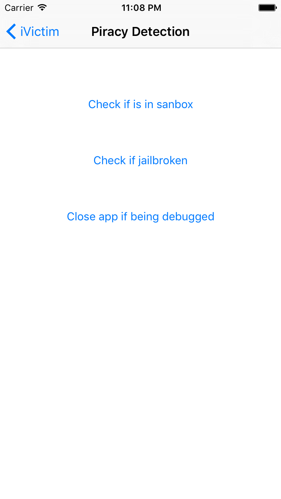

# iVictim #

### Home
<h3 align="left">

</h3>

    

    
This is test

### Bad Log In
<h3 align="left">

</h3>

### Local storage
<h3 align="left">

</h3>

### Brute Force
<h3 align="left">

</h3>

### Transport Layer Security
<h3 align="left">

</h3>

### SSL Pinning
<h3 align="left">

</h3>

### Code Injection
<h3 align="left">

</h3>

### Piracy Detection
<h3 align="left">

</h3>

### Pasteboard Problem
<h3 align="left">

</h3>

### Screenshot Problem
<h3 align="left">

</h3>

## License
GNU GENERAL PUBLIC LICENSE