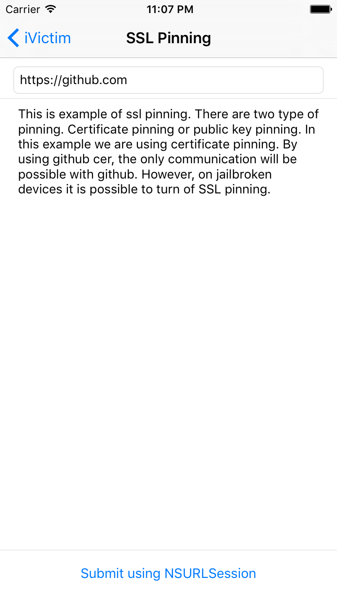

# iVictim #

.left {
float: left;
width: 50%;
}
.right {
float: right;
width: 50%;
}

### Home
<h3 align="left"> 
 
</h3> 

Lorem ipsum dolor sit amet, consectetur adipisicing elit. Minima corporis voluptates repellat ullam labore qui voluptatum error nesciunt ratione dolorem fugiat veritatis ipsum nobis eius dicta est obcaecati ab animi illum molestias accusamus cum laboriosam magni recusandae earum unde fuga deserunt laudantium facere ducimus rerum tempora pariatur consectetur iste nulla a aut ea sit nam autem doloremque iusto exercitationem voluptatem facilis eos quasi. Mollitia sequi assumenda corrupti repellendus ex amet reprehenderit animi illum ducimus totam unde quia distinctio quam velit magnam. Voluptatibus dolores natus sint enim fugiat. Sapiente voluptates enim officiis. Iste repudiandae illo nulla sed nam a ratione iure?

 

### Bad Log In
<h3 align="left">

</h3>

### Local storage
<h3 align="left">

</h3>

### Brute Force
<h3 align="left">

</h3>

### Transport Layer Security
<h3 align="left">

</h3>

### SSL Pinning
<h3 align="left">

</h3>

### Code Injection
<h3 align="left">

</h3>

### Piracy Detection
<h3 align="left">

</h3>

### Pasteboard Problem
<h3 align="left">

</h3>

### Screenshot Problem
<h3 align="left">

</h3>

## License
GNU GENERAL PUBLIC LICENSE